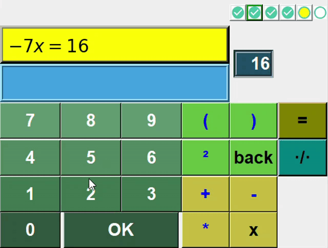

* Žaidimas paleidžiamas per failą **matsymply.py**
* Žaidime yra 6 lygiai, skirti mokytis spręsti tiesines lygtis pagal mokyklinę 7 klasės programą.
* Kiekviename lygyje yra po 10 uždavinių.
* Naujas lygis atsirakina tik tada, kai teisingai išsprendžiami bent 9 uždaviniai.
* Visi atsakymai turi prasidėti x=... išlaikant idėją, kad lygties sprendimo tikslas yra ne vien tik atsakymo gavimas, bet kryptingi lygybės pertvarkymai, vedantys link atsakymo.
* Norint įvesti trupmeną, reikia aktyvuoti įvedimą į vardiklį arba skaitiklį.
* Galima įvedinėti tik netaisyklingąsias trupmenas, mišriosios trupmenos neužskaitomos.

